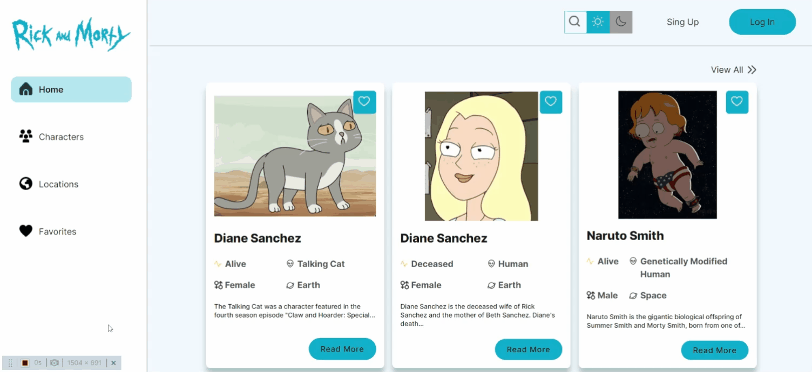

# rick_and_morty_react.js
This project is a catalog of articles on the Rick and Morty series. You can view Characters and Locations, write comments to them and save your favorite Character or Location cards to your favorites.

### Features:
* Dark and light theme

* Filter by character and location categories

* Switching between card views

* Classic pagination

* Infinite scroll

* Add/remove comments

* Saving to favorites

* Can view more detailed information about the card

* Skeleton Loader for cards
***
  
## 🛠 Installation and Setup Instructions

### `npm install`

Run `npm install` inside the main project folder to install all dependencies from NPM.

If you want to use `yarn` to install dependencies, first run the [yarn import](https://classic.yarnpkg.com/en/docs/cli/import/) command. This will ensure that yarn installs the package versions that are specified in `package-lock.json`.

### `npm start`

Runs the app in the development mode. 
Open [http://localhost:3000](http://localhost:3000) to view it in the browser. The page will reload if you make edits.

### `npm run build`

Builds the app for production to the `build` folder. 
It correctly bundles React in production mode and optimizes the build for the best performance.

The build is minified and the filenames include the hashes. 
Your app is ready to be deployed!

### This project was built using these technologies:  
* HTML
* SCSS
* Javascript
* React/Redux
* Webpack
* Visual Studio Code, Chrome Developer Tools
  
### Linters were also used
* ESlint
* Stylelint SCSS